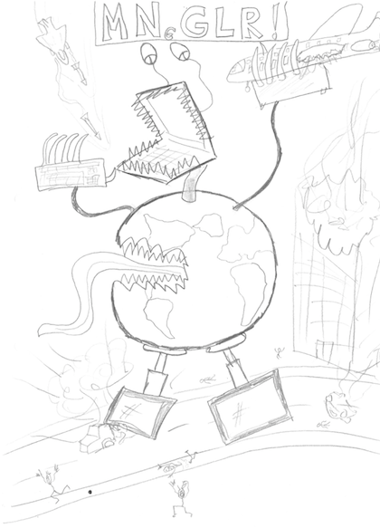

Regionalization in Brightway2
=============================

``bw2regional`` is a separate library that extends the `Brightway LCA framework <https://brightwaylca.org>`__ to do regionalized LCA calculations.



It is easy to do regionalized LCA incorrectly. This package tries to make it at least a bit easier to do regionalization correctly, for at least some definitions of correct.

bw2regional supports the following regionalization calculations:

    #. Inventory database and impact assessment method share the same spatial scale (:ref:`one-scale`)
    #. Inventory and impact assessment have different spatial scales (:ref:`two-scales`)
    #. Inventory and impact assessment have different spatial scales, with background loading used for spatial allocation (:ref:`two-scales-with-loading`)
    #. Inventory and impact assessment have different spatial scales, with extension tables used as a third spatial scale to allocate impact assessment units to inventory units.

In addition to making regionalized LCA calculations, maps of regionalized impact can be exported from methods 2-4.

Each separate spatial scale is stored as a ``geocollection``. The relationships between spatial scales (i.e. how much area of unit *a* in spatial scale *1* intersects unit *b* in spatial scale *2*) is stored as an ``Intersection``. Areal intersection calculations are done using the separate utility `pandarus <https://bitbucket.org/cmutel/pandarus>`__, a library for matching spatial data sets and calculating their mutual intersected areas. Impact assessment methods store characterization factors per biosphere flow and spatial unit. Each organization unit is described in more detail below.

``bw2regional`` is part of a family of software libraries - see :ref:`libraries` for more information.

Lifecycle of a regionalized LCA calculation
===========================================

A new project is created, and ``bw2setup()`` is run. Background databases are imported, and some foreground data in added. ``bw2regionalsetup()`` is run (see :ref:`basedata` for more information), and the function ``fix_ecoinvent_database()`` is run for each inventory database which uses ecoinvent-specific location codes.

A regionalized LCIA method is chosen. One or more geocollections are created for the LCIA method, including specifying filepaths to the raster or vector datasets which define these geocollections and characterization factors. Regionalized characterization factors are imported from the spatial datasets using the function ``import_regionalized_cfs()``.

Most of the time, a third spatial scale is created, either a `Loading` or `ExtensionTable`. This third scale defines activity intensities within the larger inventory locations. Another geocollection is created for this third spatial scale, which includes specifying another spatial data file.

A functional unit for analysis is chosen, and the function ``check_needed_intersections()`` is called to get all necessary ``Intersection`` datasets. Most of the time, some intersections will need to be calculated, and the method ``remote.get_needed_intersections()`` can be called to do all necessary GIS calculations remotely. This step may take some time.

Finally, an LCA object is created. Depending on the study, and whether a third spatial scale was added, this will be an instance of `OneSpatialScaleLCA`, `TwoSpatialScalesLCA`, `TwoSpatialScalesWithGenericLoadingLCA`, or `ExtensionTablesLCA`. Regionalized results can be summarized numerically, or exported to maps using methods like ``write_results_to_ia_map()``, ``write_results_to_inv_map()``, and ``write_results_to_xtable_map()``.

Project setup
=============

Please run the utility function ``bw2regionalsetup()`` in each new project that will do regionalized LCA calculations.

Any version of ecoinvent will need to be processed with the utility function ``fix_ecoinvent_database("some ecoinvent database name")``. This function will do the following:

    * Convert any Rest-of-World locations into actual world regions and subsequently relabel them.
    * Relabel any ecoinvent-specific locations names to place them inside the ``ecoinvent`` geocollection.

Spatial scales (``geocollections``)
===================================

A geocollection is a container for a set of locations. For example, the `world` geocollection contains a political version of the world, while other geocollections could list the watersheds or ecoregions of the world. A geocollection can be as simple as just a name, but if you want to be able to export maps or import characterization factors, the following fields should be provided:

    * ``filepath``: The absolute filepath to the vector or raster dataset.
    * ``field``: The unique field that identifies each feature, e.g. name for countries.
    * ``layer``: The name of the layer. Only needed for vector datasets with more than one layer.
    * ``encoding``: The text encoding. Only needed for shapefiles.
    * ``vfs``: For shapefiles stored in zip archives, this is the virtual file system string, e.g. ``vfs="zip:///path/to/file/ne_50m_admin_0_countries.zip"``. Note that with a vfs, you must spcify the filepath within the zip archive, e.g. ``filepath="/ne_50m_admin_0_countries.shp"``. See also `the fiona manual <https://github.com/Toblerity/Fiona#collections-from-archives-and-virtual-file-systems>`__.

Example creation of a geocollection:

.. code-block:: python

    from bw2regional import *
    geocollections['water cfs'] = {'filepath': '/my/favorite/directory/some-raster-dataset.tiff'}

Default geocollections
``````````````````````

The setup function `bw2regionalsetup` creates the following geocollections:

* `world`: All countries in the world, as well as the global location `GLO`, which has no spatial definition.
* `ecoinvent`: Ecoinvent-specific locations, including UN regions and subregions, composite geographies, and other ecoinvent-specific locations. See the `ecoinvent geography report <http://geography.ecoinvent.org/report/>`__ for more information.

Topocollections
```````````````

For performance reasons, calculations done using large-scale and overlapping geocollections can be split into many smaller topological faces. `Brightway2-regional` will perform such splitting automatically for calculations using most LCI databases. See the technical documentation for more details.

Intersections
=============

An ``Intersection`` is a dataset that shows the areal intersections between the spatial units of two geocollections. For example, if the `world` geocollection had the location "Netherlands", and the `watersheds` geocollection had the location "Rhine watershed", then the intersection `("world", "watersheds")` would include the line `(("world", "Netherlands"), ("watersheds", "Rhine watershed")): 423.7`, though this number is made up. Areal intersections can be calculated using whatever GIS software and projection that you want, but ``brightway2-regional`` is designed to work seamlessly with `pandarus <https://bitbucket.org/cmutel/pandarus>`__, which can quickly and painlessly do these areal intersection calculations and write data in a data format ``brightway2-regional`` understands.

An ``Intersection`` object does not have its own name, but rather is defined by the two ``geocollections`` which are intersected.

Example use of pandarus (see also the `pandarus documentation <http://pandarus.readthedocs.io/en/latest/>`__):

.. code-block:: bash

    pandarus /Users/somebody/some-raster.tiff /Users/somebody/some-shapefile.shp --field2=name foo.bar

This would create the file ``foo.bar.json.bz2``.

Example import of pandarus output data:

.. note:: You should create the geocollections first before creating an `Intersection` between them.

.. code-block:: python

    from bw2regional import *
    geocollections['some-raster'] = {'filepath': u'/Users/somebody/some-raster.tiff'}
    geocollections['some-shapefile'] = {
                                        'filepath': u'/Users/somebody/some-shapefile.shp',
                                        'field': 'name'
                                        }
    Intersection(('some-raster', 'some-shapefile')).import_from_pandarus('foo.bar.json.bz2')

Contents:

.. toctree::
   :maxdepth: 2

   formats
   lca
   common
   base-data
   libraries
   technical

Development
===========

bw2regional is developed by `Chris Mutel <http://chris.mutel.org/>`_, previously during his work as a postdoctoral assistant in the `Ecological Systems Design group <http://www.ifu.ethz.ch/ESD/index_EN>`__ at ETH Zürich, and currently as a scientist in the `Technology Assessment group <http://www.psi.ch/ta/>`__ at the Paul Scherrer Institute.

Source code is available on `bitbucket <https://bitbucket.org/cmutel/brightway2-regional>`__.

Indices and tables
==================

* :ref:`genindex`
* :ref:`modindex`
* :ref:`search`

